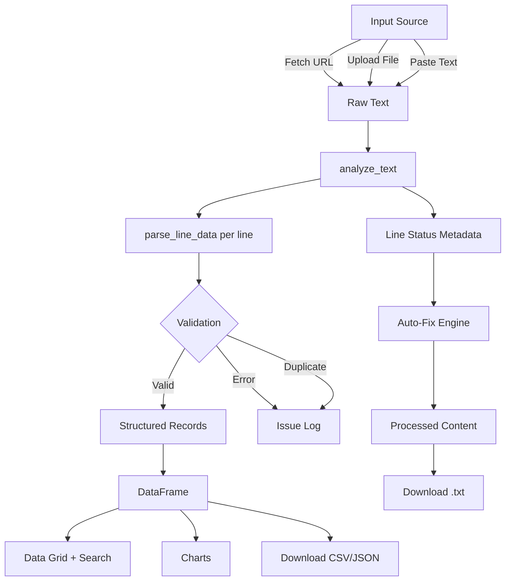

# Ads.txt Inspector & Optimizer

A production-ready Streamlit application for validating, debugging, and optimizing `ads.txt` and `app-ads.txt` inventory declarations with fast, actionable diagnostics.

[](https://www.python.org/)
[](https://streamlit.io/)
[](LICENSE)
[](https://pandas.pydata.org/)

> [!NOTE]
> This repository ships as a Streamlit web app and not a standalone pip-installable package. The parsing and validation logic is implemented in `app.py` and can be refactored into a reusable library if needed.

## Table of Contents

- [Features](#features)
- [Tech Stack & Architecture](#tech-stack--architecture)
  - [Core Stack](#core-stack)
  - [Project Structure](#project-structure)
  - [Key Design Decisions](#key-design-decisions)
- [Getting Started](#getting-started)
  - [Prerequisites](#prerequisites)
  - [Installation](#installation)
- [Testing](#testing)
- [Deployment](#deployment)
- [Usage](#usage)
- [Configuration](#configuration)
- [License](#license)
- [Contacts & Community Support](#contacts--community-support)

## Features

- Multi-source ingestion pipeline:
  - Fetches remote `ads.txt` / `app-ads.txt` over HTTPS from a provided domain.
  - Accepts local `.txt` file uploads.
  - Supports direct paste-and-analyze workflows.
- Standards-oriented record parsing:
  - Normalizes and tokenizes comma-separated records.
  - Supports canonical relationship types (`DIRECT`, `RESELLER`).
  - Detects malformed entries with missing fields and invalid relationship types.
- Duplicate detection engine:
  - Builds a case-insensitive composite key (`domain + publisher_id + type`) to identify duplicate seller records.
- Automated remediation:
  - One-click `Auto-Fix` comments invalid lines and removes duplicate records.
  - Preserves non-record lines (blank/comment lines) during processing.
- Rich analytical surface:
  - Validation metrics (`valid`, `errors`, `duplicates`, `total lines`).
  - Interactive issue log categorized by severity.
  - Data grid with full-text filtering for domain and publisher IDs.
  - Built-in visual analytics (account type split, top ad systems, certification authority usage).
- Export workflows:
  - Downloads cleaned text output (`.txt`).
  - Exports tabular datasets as `CSV` and `JSON`.
- Stateful editing UX:
  - Uses Streamlit session state to preserve `raw_content` and `processed_content` across interactions.

> [!TIP]
> Use `Fetch URL` first when auditing production publishers, then run `Auto-Fix`, and finally export CSV/JSON snapshots for compliance reporting.

## Tech Stack & Architecture

### Core Stack

- **Language:** Python
- **UI Framework:** Streamlit
- **Data Processing:** Pandas
- **HTTP Client:** Requests
- **URL Normalization:** `urllib.parse`
- **Serialization/Buffer Utilities:** `json`, `io`

### Project Structure

```text
.
├── app.py             # Main Streamlit UI + parser + validator + analytics logic
├── requirements.txt   # Python dependencies
├── README.md          # Project documentation
└── LICENSE            # Apache-2.0 license text
```

### Key Design Decisions

- **Single-file application architecture:** Keeps deployment and onboarding friction low for non-backend-heavy teams.
- **Line-first parsing model:** Preserves original line order and line numbers, enabling precise issue localization.
- **Status-tagged records:** Each input line is annotated as `neutral`, `valid`, `error`, or `duplicate` to support both UI rendering and auto-fix logic.
- **Separation of concerns in runtime flow:**
  - Parse and validate text.
  - Build structured records for tabular/analytics views.
  - Persist mutable state for iterative refinement.



> [!IMPORTANT]
> Duplicate detection intentionally uses a strict key of `domain`, `publisher ID`, and `relationship type`. If your operation requires looser matching (for example, by ignoring type), adjust the key-generation strategy in `analyze_text`.

## Getting Started

### Prerequisites

- Python `3.10+` recommended
- `pip` (latest stable)
- Internet access (optional, required only for remote URL fetch mode)

### Installation

```bash
git clone https://github.com/<your-org>/<your-repo>.git
cd Validate-and-Optimize-app-ads.txt-ads.txt-file
python -m venv .venv
source .venv/bin/activate  # Windows: .venv\Scripts\activate
pip install --upgrade pip
pip install -r requirements.txt
```

Run the application:

```bash
streamlit run app.py
```

By default, Streamlit serves the app locally and prints the access URL in the terminal (typically `http://localhost:8501`).

## Testing

This repository does not currently include a dedicated test suite (`tests/`), but you can still run baseline quality and runtime checks.

```bash
# Syntax check
python -m py_compile app.py

# Optional static analysis (install first: pip install ruff)
ruff check app.py

# Launch and manually validate key flows
streamlit run app.py
```

Suggested manual validation checklist:

1. Fetch `ads.txt` from a known domain and verify successful ingestion.
2. Upload a file containing malformed rows and confirm error detection.
3. Trigger `Auto-Fix` and verify invalid rows are commented + duplicates removed.
4. Validate `CSV` and `JSON` exports against table-filtered results.

> [!WARNING]
> URL fetching currently targets `https://{domain}/{file_type}` and does not implement fallback retry policies, redirects customization, or advanced error classification.

## Deployment

### Streamlit Community Cloud

1. Push repository to GitHub.
2. Open [Streamlit Community Cloud](https://streamlit.io/cloud).
3. Create a new app and connect your repository.
4. Set entrypoint to `app.py`.
5. Deploy.

### Containerization (Optional)

Use this minimal Docker workflow for reproducible runtime packaging:

```dockerfile
FROM python:3.11-slim
WORKDIR /app
COPY requirements.txt .
RUN pip install --no-cache-dir -r requirements.txt
COPY . .
EXPOSE 8501
CMD ["streamlit", "run", "app.py", "--server.port=8501", "--server.address=0.0.0.0"]
```

Build and run:

```bash
docker build -t ads-txt-inspector .
docker run --rm -p 8501:8501 ads-txt-inspector
```

### CI/CD Integration Guidance

A pragmatic CI pipeline should include:

- Dependency installation from `requirements.txt`
- Lint/static checks (`ruff check app.py`)
- Syntax verification (`python -m py_compile app.py`)
- Optional smoke test by importing core parser functions in a short script

## Usage

### 1) Launch Interactive UI

```bash
streamlit run app.py
```

### 2) Parse and Validate Ads Records Programmatically

Although optimized for UI, core functions can be imported for script-based workflows.

```python
from app import clean_url, parse_line_data, analyze_text

raw = """
google.com, pub-123, DIRECT, f08c47fec0942fa0
google.com, pub-123, DIRECT, f08c47fec0942fa0
invalid,line
""".strip()

# Normalize domain inputs
print(clean_url("example.com"))  # example.com

# Parse an individual row
item = parse_line_data("google.com, pub-123, DIRECT, f08c47fec0942fa0")
print(item["type"])  # DIRECT

# Run full analysis pipeline
lines_meta, records, stats, warnings = analyze_text(raw)
print(stats)      # {'valid': ..., 'errors': ..., 'duplicates': ..., ...}
print(warnings)   # Human-readable diagnostics with line numbers
```

### 3) In-App Workflow

1. Select input source (`Fetch URL`, `Upload File`, or `Paste Text`).
2. Review validation metrics and issue log.
3. Optionally execute `Auto-Fix`.
4. Inspect filtered records in `Data Grid`.
5. Export final artifacts as `.txt`, `.csv`, or `.json`.

> [!CAUTION]
> `Auto-Fix` is intentionally destructive for duplicate rows (they are removed). Keep original source files if you need a full audit trail.

## Configuration

The current implementation is mostly code-configured and does not require `.env` variables.

### Runtime/Startup Flags

You can customize Streamlit runtime using CLI flags:

```bash
streamlit run app.py --server.port 8501 --server.address 0.0.0.0
```

### In-Code Configuration Points

- `st.set_page_config(page_title="Ads.txt Inspector", layout="wide")` for UI defaults.
- URL fetch timeout configured in `requests.get(..., timeout=10)`.
- Supported file types in sidebar selector: `app-ads.txt` and `ads.txt`.
- Relationship type allowlist in parser: `DIRECT`, `RESELLER`.

### Optional `.env` Extension Pattern (Future-Friendly)

If you want environment-driven configuration, add `python-dotenv` and define values such as:

```env
REQUEST_TIMEOUT=10
DEFAULT_FILE_TYPE=app-ads.txt
STREAMLIT_SERVER_PORT=8501
```

Then read them in `app.py` and apply defaults centrally.

## License

This project is licensed under the Apache License 2.0. See [`LICENSE`](LICENSE) for full terms.

## Contacts & Community Support

## Support the Project

[](https://www.patreon.com/OstinFCT)
[](https://ko-fi.com/fctostin)
[](https://boosty.to/ostinfct)
[](https://www.youtube.com/@FCT-Ostin)
[](https://t.me/FCTostin)

If you find this tool useful, consider leaving a star on GitHub or supporting the author directly.
