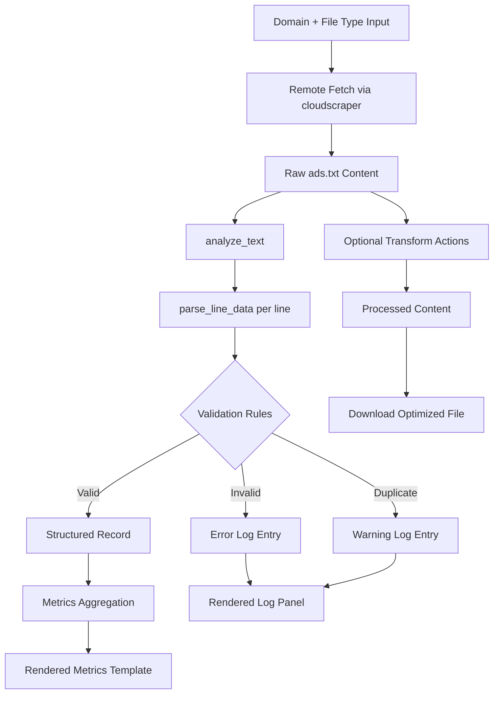

# 1. Title and Description

# Ads.txt Inspector Logging Library

A production-focused Python logging and diagnostics library for validating, tracing, and operationalizing `ads.txt` / `app-ads.txt` quality workflows.

[](#6-testing)
[](#)
[](LICENSE)
[](https://www.python.org/)
[](#6-testing)

> [!NOTE]
> The current repository ships a Streamlit application (`app.py`) plus modular analysis/render components. The "logging library" language in this README reflects the diagnostics-centric core (`inspector/analyzer.py`) and log rendering pipeline (`inspector/render.py`).

> [!IMPORTANT]
> This project is optimized for operational debugging and compliance validation of seller declaration files. It is not a generic application logger for arbitrary services.

# 2. Table of Contents

- [1. Title and Description](#1-title-and-description)
- [2. Table of Contents](#2-table-of-contents)
- [3. Features](#3-features)
- [4. Tech Stack & Architecture](#4-tech-stack--architecture)
- [5. Getting Started](#5-getting-started)
- [6. Testing](#6-testing)
- [7. Deployment](#7-deployment)
- [8. Usage](#8-usage)
- [9. Configuration](#9-configuration)
- [10. License](#10-license)
- [11. Contacts & Community Support](#11-contacts--community-support)

# 3. Features

- Deterministic line-by-line parsing for `ads.txt`-style declarations.
- Structured anomaly classification for:
  - invalid syntax,
  - unsupported relationship type,
  - duplicate seller records.
- Built-in diagnostics output with warning/error messages tied to source line numbers.
- Composite duplicate keying strategy (`domain + publisher_id + relationship_type`) for strict de-duplication.
- Session-driven operational workflow via Streamlit for iterative cleanup.
- HTML-based log panel rendering with severity-specific visual cues.
- Templated metric rendering (`templates/metrics.html`) for standardized UI telemetry blocks.
- Style isolation in `assets/css/styles.css` and static frontend scaffolding in `index.html`.
- Download-ready optimized output generation for post-validation publishing.
- Extensible architecture with clear separation between:
  - fetch/orchestration (`app.py`),
  - parsing/analysis (`inspector/analyzer.py`),
  - rendering (`inspector/render.py`).

> [!TIP]
> For production auditing, run validation first, then remove duplicates, then export and retain original source files for traceability.

# 4. Tech Stack & Architecture

## Core Languages, Frameworks, and Dependencies

- **Language:** Python 3.10+
- **UI Runtime:** Streamlit
- **HTTP Fetching:** `cloudscraper`
- **URL Handling:** `urllib.parse`
- **Template/CSS Asset Strategy:** file-based HTML/CSS loading

> [!NOTE]
> The architecture intentionally uses thin orchestration in `app.py` with reusable analysis/render modules to reduce cognitive load and support future unit testing.

## Project Structure

<details>
<summary>Expand full repository tree (relevant runtime files)</summary>

```text
.
├── app.py
├── assets
│   ├── css
│   │   └── styles.css
│   └── js
│       └── app.js
├── index.html
├── inspector
│   ├── __init__.py
│   ├── analyzer.py
│   └── render.py
├── templates
│   ├── metrics.html
│   └── result_header.html
├── requirements.txt
├── README.md
└── LICENSE
```

</details>

## Key Design Decisions

- **Parser purity:** `analyze_text` operates purely on input text and returns deterministic metadata/stats.
- **Diagnostic-first workflow:** each line is classified into semantic states (`neutral`, `valid`, `error`, `duplicate`) before any mutation.
- **Separation of concerns:** analysis logic and presentation rendering are split into dedicated modules.
- **Template-backed UI fragments:** reusable HTML snippets reduce coupling and simplify UI iteration.
- **Operational ergonomics:** one-click actions (`Comment Out Errors`, `Remove Duplicates`) optimize manual remediation.

<details>
<summary>Architecture and logging pipeline diagram (Mermaid)</summary>



</details>

# 5. Getting Started

## Prerequisites

- Python `3.10` or newer
- `pip` (latest stable recommended)
- Git CLI
- Optional: Docker (for containerized deployment)

## Installation

```bash
git clone https://github.com/<your-org>/<your-repo>.git
cd Validate-and-Optimize-app-ads.txt-ads.txt-file
python -m venv .venv
source .venv/bin/activate  # Windows: .venv\Scripts\activate
pip install --upgrade pip
pip install -r requirements.txt
```

Run the application:

```bash
streamlit run app.py
```

> [!WARNING]
> Some publisher endpoints may be WAF-protected or rate-limited. Fetch failures do not always indicate malformed configuration.

<details>
<summary>Troubleshooting and alternative setup paths</summary>

### Common Setup Issues

- **`streamlit: command not found`**
  - Ensure virtual environment is activated.
  - Reinstall dependencies with `pip install -r requirements.txt`.

- **TLS/network fetch errors**
  - Validate outbound network access and DNS resolution.
  - Test with known reachable domains.

- **Dependency resolution problems**
  - Upgrade `pip`, then retry installation.
  - Pin packages manually in a lockfile if your environment requires deterministic builds.

### Source-Only Execution

If you only need parser behavior, run a direct Python shell and import from `inspector.analyzer` without launching Streamlit.

</details>

# 6. Testing

This repository does not currently include a dedicated `tests/` suite. Use the following validation commands:

```bash
python -m compileall app.py inspector
python -m py_compile app.py
streamlit run app.py
```

Recommended local quality checks:

```bash
# Optional linter (install first)
ruff check app.py inspector

# Optional formatter check
ruff format --check app.py inspector
```

> [!CAUTION]
> UI behavior validation is primarily manual at this stage. If you need CI-grade confidence, add unit tests for `clean_url`, `parse_line_data`, and `analyze_text` first.

# 7. Deployment

## Production Deployment Guidelines

- Keep configuration immutable per environment.
- Run behind a reverse proxy if exposing publicly.
- Monitor request latency and remote fetch failure rates.
- Preserve original input artifacts for auditability.

## Build and Runtime

```bash
pip install -r requirements.txt
streamlit run app.py --server.port 8501 --server.address 0.0.0.0
```

## Containerization Example

```dockerfile
FROM python:3.11-slim
WORKDIR /app
COPY requirements.txt .
RUN pip install --no-cache-dir -r requirements.txt
COPY . .
EXPOSE 8501
CMD ["streamlit", "run", "app.py", "--server.port=8501", "--server.address=0.0.0.0"]
```

<details>
<summary>CI/CD integration checklist</summary>

- Install dependencies from `requirements.txt`.
- Execute syntax checks and optional linting.
- Run import smoke tests for `inspector.analyzer` and `inspector.render`.
- Publish container image or deploy app artifact.
- Gate production rollout on successful pipeline status.

</details>

# 8. Usage

## Basic Usage

Launch Streamlit:

```bash
streamlit run app.py
```

Programmatic parser usage:

```python
from inspector.analyzer import clean_url, analyze_text

raw_text = """
google.com, pub-123, DIRECT, f08c47fec0942fa0
google.com, pub-123, DIRECT, f08c47fec0942fa0
invalid,line
""".strip()

domain = clean_url("https://example.com")  # normalize user input
lines_meta, records, stats, warnings = analyze_text(raw_text)  # run diagnostics pipeline

print(domain)
print(stats)
print(warnings)
```

> [!NOTE]
> The returned `warnings` payload is the canonical diagnostics stream and can be forwarded to any external logging backend if needed.

<details>
<summary>Advanced Usage: integrating diagnostics into custom logging sinks</summary>

```python
from inspector.analyzer import analyze_text
import json

content = "example.com, pub-1, DIRECT\nexample.com, pub-1, DIRECT"
_, _, _, warnings = analyze_text(content)

for event in warnings:
    # Replace print with your structured logger (e.g., structlog, ELK shipper, OpenTelemetry exporter)
    print(json.dumps({"severity": event["type"], "message": event["msg"]}))
```

### Custom Formatters

- Severity-to-color mapping can be adjusted in `assets/css/styles.css`.
- HTML wrapper output can be extended in `inspector/render.py` and `templates/*.html`.

### Edge Cases

- Empty lines and comments are treated as `neutral` lines.
- Records with fewer than three comma-separated fields are treated as syntax errors.
- Relationship types outside `DIRECT`/`RESELLER` are treated as invalid.

</details>

# 9. Configuration

## Runtime Configuration Surfaces

- Streamlit page metadata in `app.py`.
- Supported file type options (`app-ads.txt`, `ads.txt`).
- Request timeout on remote fetch.
- Allowed relationship types in `inspector/analyzer.py` via `VALID_TYPES`.

## Environment Variables

No mandatory `.env` variables are required by default.

> [!TIP]
> For production hardening, externalize timeout, default file type, and endpoint policies through environment variables and load them at startup.

<details>
<summary>Suggested exhaustive configuration schema (example)</summary>

```yaml
app:
  page_title: "Ads.txt Inspector"
  layout: "wide"

network:
  request_timeout_seconds: 15
  user_agent_profile: "chrome_windows"

validation:
  allowed_relationship_types:
    - DIRECT
    - RESELLER
  duplicate_key_fields:
    - domain
    - publisher_id
    - relationship_type

output:
  default_download_filename: "app-ads-optimized.txt"
  include_warning_stream: true

logging:
  emit_json: false
  include_line_numbers: true
  severity_levels:
    error: "error"
    warning: "warning"
```

Example `.env` extension:

```env
REQUEST_TIMEOUT_SECONDS=15
DEFAULT_FILE_TYPE=app-ads.txt
STREAMLIT_PORT=8501
STREAMLIT_ADDRESS=0.0.0.0
```

</details>

# 10. License

This project is licensed under the Apache License 2.0. See [`LICENSE`](LICENSE) for full legal terms and usage rights.

# 11. Contacts & Community Support

## Support the Project

[](https://www.patreon.com/OstinFCT)
[](https://ko-fi.com/fctostin)
[](https://boosty.to/ostinfct)
[](https://www.youtube.com/@FCT-Ostin)
[](https://t.me/FCTostin)

If you find this tool useful, consider leaving a star on GitHub or supporting the author directly.
